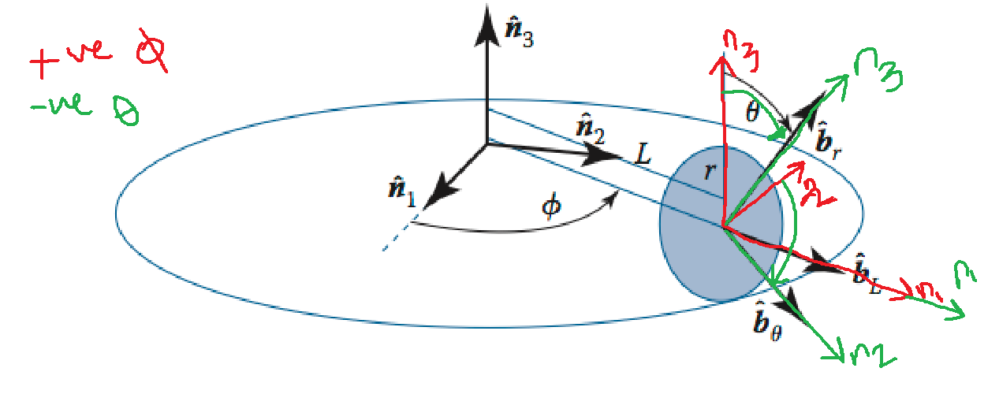

# Question 1
Given the (3-2-1) Euler angle set with `$\theta_1$` = 20 deg, \theta_2 =10 deg and \theta_3 = -10;$` 
what is the equivalent (3-1-3) set?
### Mahematica Code
`Module[{\[Theta]1=20 ,\[Theta]2=10,\[Theta]3=-10},
(mn=EulerMatrix[{\[Theta]1/180*\[Pi],\[Theta]2/180*\[Pi],\[Theta]3/180*\[Pi]},{3,2,1}]);
mn=N[mn];
EulerAngles[mn,{3,1,3}]]`
- [ ] A
- [x] B
- [ ] C
# Question 2
To transfer from the inertial Frame to Body frame, the following axes transformation should be applied

But in the question it's required to get [BN], so the oppsite rotation is to be made.    
The reference frames N:{n^1,n^2,n^3} and B:{b^L,b^θ,b^r} are shown in the Figure. The disk is rolling on the ring without slip.

Find the direction cosine matrix [BN] in terms of the angle \phi.  
### Mahematica Code
`Module[{\[Theta]=L*\[Phi]/r,vb={{2},{1},{1}}},
(BN=EulerMatrix[{\[Theta],0,-\[Phi]},{1,2,3}]);
(*BN//MatrixForm*)
vN=Transpose[BN].vb//MatrixForm
]`
- [x] A
- [ ] B
- [ ] C

# Question 3
The reference frames N:{n^1,n^2,n^3} and B:{b^L,b^θ,b^r} are shown in the Figure. The disk is rolling on the ring without slip.

Given the vector Bv=1b^r+1b^θ+2b^L, find the vector Nv
- [x] A
- [ ] B
- [ ] C

# Question 4
Consider the set of (2-3-2) Euler angles.

Find the mapping of these angles (\theta_1, \theta_2, \theta_3)to the corresponding [C] DCM
- [ ] A
- [x] B
- [ ] C
### Mahematica Code
`Module[{\[Theta]1=Subscript[\[Theta], 1],\[Theta]2=Subscript[\[Theta], 2],\[Theta]3=Subscript[\[Theta], 3]},
Transpose[EulerMatrix[{\[Theta]1,\[Theta]2,\[Theta]3},{2,3,2}]]//MatrixForm]`
# Question 5
Consider the set of (2-3-2) Euler angles.

Find appropriate inverse transformations from [C][C] back to the (2-3-2) Euler angles.
- [ ] A
- [x] B
- [ ] C
